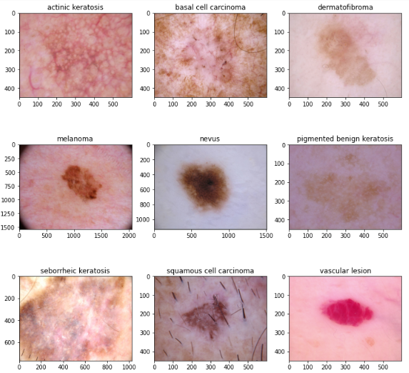

# CNN Assignment: Melanoma Detection Assignment

>To build a CNN based model which can accurately detect melanoma. Melanoma is a type of cancer that can be deadly if not detected early. It accounts for 75% of skin cancer deaths. A solution that can evaluate images and alert dermatologists about the presence of melanoma has the potential to reduce a lot of manual effort needed in diagnosis.

- The data set contains the following diseases:

  - Actinic keratosis
  - Basal cell carcinoma
  - Dermatofibroma
  - Melanoma
  - Nevus
  - Pigmented benign keratosis
  - Seborrheic keratosis
  - Squamous cell carcinoma
  - Vascular lesion
  
- Build a CNN model, which can accurately detect 9 classes present in the dataset

## Table of Contents
* [Abstract](#abstract)
* [Summary](#summary)
* [Technologies Used](#technologies-used)
* [Contact](#contact)

<!-- You can include any other section that is pertinent to your problem -->
## Abstract
In cancer, there are over 200 different forms. Out of 200, melanoma is the deadliest form of skin cancer. The diagnostic procedure for melanoma starts with clinical screening, followed by dermoscopic analysis and histopathological examination. Melanoma skin cancer is highly curable if it gets identified at the early stages. The first step of Melanoma skin cancer diagnosis is to conduct a visual examination of the skin's affected area. Dermatologists take the dermatoscopic images of the skin lesions by the high-speed camera, which have an accuracy of 65-80% in the melanoma diagnosis without any additional technical support. With further visual examination by cancer treatment specialists and dermatoscopic images, the overall prediction rate of melanoma diagnosis raised to 75-84% accuracy. The project aims to build an automated classification system based on image processing techniques to classify skin cancer using skin lesions images.

### Sample Images

  

<!-- You don't have to answer all the questions - just the ones relevant to your project. -->

## Summary
- **Seborrheic Keratosis** has least number of samples
- **Pigmented benign keratosis** be the dominating classes followed by **Melanoma**
- With the base CNN model, the model is suffering from over-fitting
    - Training Accuracy: ~73%     
    - Validation Accuracy: ~45%
- To control the overfitting problem, we applied **Data Augmentation Strategy**. With this we can able to control the accuracy
    - Training Accuracy: ~50%     
    - Validation Accuracy: ~50%
- To improve the accuracy, we used the **Augmentor package** and handled the class imbalancce with 20 epochs
    - Training Accuracy: ~85%     
    - Validation Accuracy: ~78%

<!-- You don't have to answer all the questions - just the ones relevant to your project. -->

## Technologies Used
- Language: Python
- Libraries: Pandas, Numpy, Seaborn, Matplotlib, Sklearn, Keras, Tensorflow
- IDE: Google Colaboratory, Google Drive

<!-- As the libraries versions keep on changing, it is recommended to mention the version of library used in this project -->

## Contact
Created by [M M Veereshkumar](https://www.linkedin.com/in/mmveereshkumar) - Feel free to contact me!

<!-- Optional -->
<!-- ## License -->
<!-- This project is open source and available under the [... License](). -->

<!-- You don't have to include all sections - just the one's relevant to your project -->
